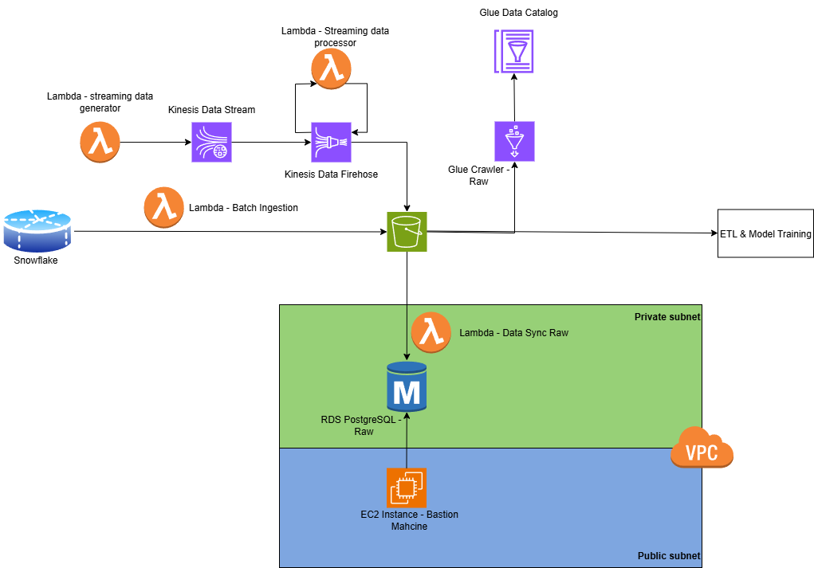

# Data Ingestion Pipeline

## Overview

This repository provides a modular, production-grade data ingestion pipeline for AWS, focusing on the batch and streaming ingestion of data from Snowflake and other sources into S3, and further synchronization with PostgreSQL RDS. The pipeline is fully managed via Terraform (IaC) and supports automated deployment through GitHub Actions.



### Directory Structure

```
.
├── .github/            # GitHub Actions CI/CD workflows
│   └── workflows/
│       ├── deploy_batch_ingestion.yml
│       ├── ...
│
├── functions/          # Functional scripts for each module
│   └── modules/
│       ├── prerequisite_snowflake_data_upstream_load/
│       │   └── snowflake_upload.py
│       ├── data_ingestion/
│       │   ├── batch/
│       │   │   ├── batch_ingestion.py
│       │   │   ├── batch_ingestion.sh
│       │   │   └── batch_ingestion_lambda/
│       │   └── streaming/
│       │       └── streaming_data_publisher.py
│       ├── vpc/
│       ├── ec2/
│       ├── rds_postgresql/
│       ├── glue_raw/
│       ├── data_sync/
│       │   ├── raw/
│       │   └── ...
│
├── terraform/          # Infrastructure as Code (Terraform)
│   ├── assets/         # Lambda zip files and other assets
│   ├── dev/            # Main entry point for Terraform deployment
│   └── modules/
│       ├── s3_buckets/
│       ├── data_ingestion/
│       │   ├── batch/
│       │   └── streaming/
│       ├── vpc/
│       ├── ec2/
│       ├── rds_postgresql/
│       ├── glue_raw/
│       ├── data_sync/
│       │   ├── raw/
│       │   └── ...
│       └── ...
└── other_files (README.md, .gitignore, .env, etc.)
```

**Key Folders:**
- `.github/workflows`: CI/CD automation for each module
- `functions/modules`: Python scripts and Lambda code for ingestion, sync, and utility
- `terraform`: All infrastructure code and deployment assets

---

## Modules

### 1. prerequisite_snowflake_data_upstream_load
- Loads raw CSV data into Snowflake from an external stage. Includes `snowflake_upload.py` for automated ingestion.

### 2. s3_buckets
- Creates S3 buckets for raw (bronze) and clean (silver) data layers. Buckets are versioned and encrypted for security.
- Raw-data (bronze) bucket: `insightflow-raw-bucket`; Clean-date (sliver) bucket: `insightflow-clean-bucket`. More buckets can be added if needed.

### 3. data_ingestion/batch
Batch ingestion from Snowflake to S3 using Lambda:
- **Source:** Snowflake Data Warehouse
- **Target:** S3 raw data bucket (`insightflow-raw-bucket`)
- **Scripts:** `batch_ingestion.py`, `batch_ingestion.sh`, Lambda deployment package. The script will split the raw data into serveral parts (by SET `batch_size`) to aviod the OOM problem when running the Lambda function.
- **Path:** the Lambda function script will generate a timestamp partition key path like `insightflow-raw-bucket/data/batch/<table_name>/year=YYYY/month=MM/day=DD/hhmm=HHMM/<table_name>_part[*].csv`. The timestamp is the trigger time of the function.
- **Scheduler:** EventBridge `batch_ingestion_trigger` has been set as the scheduler to trigger the batch ingestion Lambda function regularly. Currently it is set as `"cron(0 14 30 * ? *)"` , which means UTC time 14:00  on every 30th day of the month (i.e. Sydney time 0:00（winter time）of every 31th of the month). The rule can be adjusted per needs.

### 4. data_ingestion/streaming
Streaming ingestion module (future extension):
- **Source:** Real-time dummy data publisher by `streaming_data_publisher.py`
- Kinesis Data Stream to store the streaming data and trigger Kinesis Data Firehose
- Kinesis Data Firehose will triggered by Kinesis Data Stream and trigger `streaming_data_transformer.py` to do simple data cleaning and transformation. It will load the data after preprocessing to the target bucket `insightflow-raw-bucket`.
- **Target:** S3 raw data bucket - `insightflow-raw-bucket`
- **Scripts:** `streaming_data_publisher.py`, `streaming_data_transformer.py`

### 5. vpc
- Creates a secure VPC with public and private subnets, NAT gateway, and security groups for all necessary pipeline components (EC2 bastion machine, RDS PostgreSQL, data_sync_raw Lambda function).
- Endpoints are created for the internal connection between AWS services (e.g. PostgreSQL <-> Lambda function)

### 6. rds_postgresql
- Provisions a PostgreSQL RDS instance in a private subnet, with IAM authentication and encrypted storage.
- The database is considered as a data backup for the raw-data bucket, and maybe for the curate-data in the following stage.
- The necessary tables for data sync are created by `create_tables.sql` when initializing the EC2 bastion machine. 
- Considering the limited Lambda function capacity in data_sync, no key constraints has been set on the current tables. 

### 7. ec2
- Deploys a bastion host in the public subnet for secure SSH access RDS and debugging.
- EC2 instance creates the tables needed for data sync by `bastion-init.sh` & `create_tables.sql` when starting up.

### 8. glue_crawler_raw
- Configures AWS Glue Crawler to scan S3 raw data and update Glue Data Catalog tables for downstream ETL & analytics.
- For the first time of crawling, SET `recrawl_behavior = "CRAWL_EVERYTHING"`；for the later crawling, SET `recrawl_behavior = "CRAWL_NEW_FOLDERS_ONLY"` for cost-efficiency (`terraform.tfvars` & `deploy_batch_ingestion.yml`).
- A placeholder.txt is created in the pipeline deployment to aviod data source errors in the glue_crawler_raw deployment. These .txt files would NOT be included in glue crawling.
- **Scheduler:** Glue crawler has its own scheduler. Currently it is set as `"cron(0 15 30 * ? *)"` , which means UTC time 15:00  on every 30th day of the month (i.e. Sydney time 1:00 （winter time）of every 31th of the month). The rule can be adjusted per needs.


### 9. data_sync_raw
- Synchronizes data between S3 raw zone and PostgreSQL RDS using Lambda:
- **Functionality:** 
   1) Full sync: use the default `start_ts` and `end_ts`
   2) Incremental sync, change the `start_ts` and `end_ts` to realize the sync of data in a specific time period
- **Tech:** Python, boto3, psycopg2, VPC networking
- **Limitation:** Due to the Lamdba capacity (max runtime: 15 minutes) and the data transformation rate of RDS Postgresql, the large tables `order_products_prior` CANNOT be sync by the current Lambda function. Alternative methods would be needed to solve this problem (e.g. DMS service)
- **Scheduler:** EventBridge `lambda-s3-to-rds-schedule` has been set as the scheduler to trigger the data_sync_raw Lambda function regularly. Currently it is set as `"cron(0 16 30 * ? *)"` , which means UTC time 16:00  on every 30th day of the month (i.e. Sydney time 2:00 （winter time）of every 31th of the month). The rule can be adjusted per needs.


### 10. main entry (terraform/dev)
- Centralized entry point for deploying all modules. Contains main Terraform configuration and variable definitions.

---

## Deployment

### Local Deployment
1. Clone the repository and configure AWS credentials.
2. Initialize Terraform:
   ```bash
   cd terraform/dev
   terraform init
   terraform fmt
   terraform plan
   terraform apply
   terraform destroy (optional)
   ```
3. Run module-specific scripts as needed (see `functions/modules`).
4. The current module dependency is listed in the terraform/dev/main.tf. If you want to deploy the pipeline by module, the correct order must be followed.
5. It will take a few time to deploy all current resources. Sometimes it will report error due to the timeout of AWS credentials during a deployment. Just retry the deployment by `terraform apply` and the error will be resolved in most cases.

### GitHub Actions Deployment
1. Push changes to the `main` branch to trigger CI/CD workflows.
2. Each module is deployed in sequence via dedicated `.yml` workflows in `.github/workflows`.
3. Environment variables and secrets are managed via GitHub repository settings.
4. Monitor deployment status in the Actions tab.
5. Only the change in the main branch will trigger the auto CI/CD, you can alter the trigger methods in  `.yml` or trigger the deployment manually.
6. It will take a few time to deploy all current resources. Sometimes it will report error due to the timeout of AWS credentials. Ju

### Notes in deployment
1. To deploy the pipeline from another account, you need to set YOUR OWN AWS account's ACCESS KEY and SECRET ACCESS KEY as the environment variables.
2. Although not being complusory, it is highly recommened to set YOUR OWN Snowflake ACCOUNT INFORMATION as the enviornment variables because the author's Snowflake account is a 30-day-free trial account. 

   However, the current Snowflake access AWS via a storage_integration (https://docs.snowflake.com/en/user-guide/data-load-s3-config-storage-integration). If you use your own Snowflake account, you will need to create a new STORAGE_INTEGRATION in Snowflake and update it in the environment variables. 

   Alternatively, you can change the current "functions/modules/prerequisite_snowflake_data_upstream_load/snowflake_upload.py" and  "functions/modules/data_ingestion/batch/batch_ingestion.py" scripts to create the connection through another connection methods.

3. All variable names & values can be altered per your preference, but make sure they are correctly passed between modules.

4. For the first deployment and batch ingestion, SET `recrawl_behavior = "CRAWL_EVERYTHING"`；for the later crawling after there are alreay Glue tables, SET `recrawl_behavior = "CRAWL_NEW_FOLDERS_ONLY"` for cost-efficiency (`terraform.tfvars` & `deploy_batch_ingestion.yml`).
5. In `Terraform destroy`, be careful:
   1) the folder must be emptied if you want to destroy them as well
   2) the EC2 instance Network Interface will persist for a while (10-20 mins) even the instance has been removed. These network interfaces will delay the destroy of VPC.

### Further exploration & improvement
1. The large dataset (e.g. `order_products_prior`) CANNOT be synced by the current Lambda function. Alternative solutions might be explored (e.g. `AWS DMS`) in the later stages.
2. The incremental data sync is achieved by adjust the start & end time manually in the current Lambda function. Better solutions might be explored to realize the auto-incremental sync in the future.
3. Data orchestration service like `Amazon Managed Workflows for Apache Airflow (MWAA)` might be included in the pipeline to better coordinate the data flows in the later stages.
---
🧑‍💻 Author

Yifan Sun (Aaron)
[LinkedIn](http://www.linkedin.com/in/yifan-sun-aaron/)

Zidan Guo (Tobby)
[LinkedIn]()